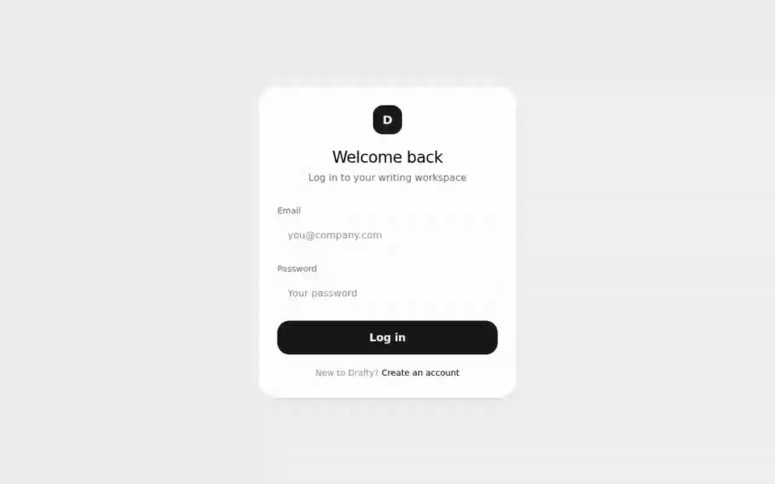
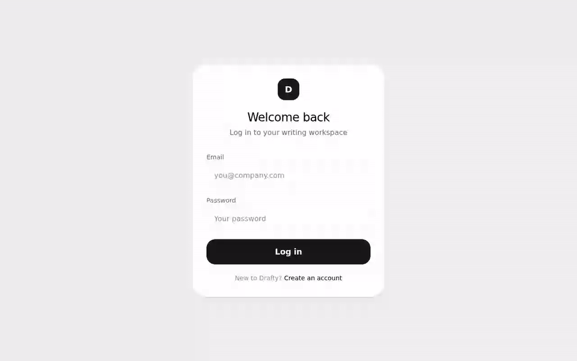

# Drafty

A fast, simple writing workspace for professionals — rich text documents behind a subscription
paywall. Marketing site → email/password auth → Stripe (test mode) checkout → gated TipTap editor.

> Take-home assignment — Senior Full Stack AI Native Developer @ Leadtech. The short write-up
> answering the three assignment questions is in [WRITEUP.md](WRITEUP.md).

## Demo

| Landing → register                                 | Pay (Stripe test checkout)          | Document workspace              |
| -------------------------------------------------- | ----------------------------------- | ------------------------------- |
|  |  |  |

## Quick start

Prerequisites: **Node 22** (see `.nvmrc`) with corepack — `corepack enable` activates the pinned
pnpm version automatically.

```bash
git clone https://github.com/sportiz91/drafty.git && cd drafty
corepack enable
pnpm install
pnpm setup     # creates .env.local with a generated JWT_SECRET + migrates the SQLite DB
pnpm dev       # → http://localhost:3000
```

That already runs the full app minus payments: landing, register/login, and the subscriber paywall.
To pay and unlock the editor, wire Stripe test mode (~5 more minutes):

### Stripe test flow

1. Put your **test** secret key (from <https://dashboard.stripe.com/test/apikeys>) in `.env.local`
   as `STRIPE_SECRET_KEY`.
2. Create a recurring price and copy its id into `STRIPE_PRICE_ID`:

   ```bash
   stripe prices create --currency=eur --unit-amount=900 \
     -d "recurring[interval]=month" -d "product_data[name]=Drafty Pro"
   ```

3. Forward webhooks — the command prints the `whsec_...` signing secret; put it in
   `STRIPE_WEBHOOK_SECRET` and restart the dev server:

   ```bash
   stripe listen --forward-to localhost:3000/api/vendor/stripe/webhooks
   ```

4. Subscribe with test card **4242 4242 4242 4242** (any future expiry, any CVC, any ZIP).

Access is granted by the webhook server-side — the success redirect alone never flips entitlement
(see [WRITEUP.md](WRITEUP.md) for the delayed-webhook story).

## Architecture

```
visitor → / (marketing) → /register → /documents (upgrade card, non-subscriber)
        → Stripe Checkout → verified webhook → subscriber → /documents (TipTap workspace)
```

One Next.js 15 (App Router) application, layered with a strict dependency direction — **route
handler → service → db action → db**:

| Layer      | Path                                 | Responsibility                                         |
| ---------- | ------------------------------------ | ------------------------------------------------------ |
| API routes | `src/app/api/v1/<domain>/`           | Zod validation, auth guards, error→HTTP mapping        |
| Services   | `src/services/`                      | Business logic: entitlement, fulfillment, sanitization |
| DB actions | `src/database/actions/`              | The only layer that touches Drizzle/SQLite             |
| UI         | `src/app/`, `src/features/<domain>/` | Server components + small client islands               |

- **Auth** — JWT access token (15 min) + opaque rotating refresh token (7 days, stored hashed), both
  `httpOnly` cookies. Every protected route re-validates server-side (`requireAuth` /
  `requireSubscriber`); the middleware only does optimistic redirects (UX, not security).
- **Billing** — Stripe hosted Checkout + Customer Portal ("Manage billing"). The signature-verified
  webhook is the **only writer** of subscription state, idempotent by event id and retry-safe
  (fulfillment failure → unmark + non-2xx → Stripe retries).
- **Documents** — TipTap editor with debounced autosave and rename, two-step delete confirm, sidebar
  with last-updated times. Every write is sanitized server-side (HTML allowlist), and ownership is
  enforced in the API: someone else's document id answers **404, same as a nonexistent one** — no
  existence oracle.

## Commands

| Command                    | What                                                 |
| -------------------------- | ---------------------------------------------------- |
| `pnpm dev`                 | Dev server (Turbopack)                               |
| `pnpm build && pnpm start` | Production build + serve (webpack — see limitations) |
| `pnpm test:unit`           | Jest unit suite (51 tests, colocated specs)          |
| `pnpm test:e2e`            | Playwright e2e (starts its own server)               |
| `pnpm code-quality`        | format check + lint + type-check                     |

Husky gates every commit (secret scan, lint-staged, `tsc`); CI runs lint → format → types → unit →
e2e on every push. The live-checkout e2e (`e2e/billing.spec.ts`) drives the **real** hosted Stripe
page and needs local secrets, so it is explicitly gated:
`STRIPE_E2E=1 pnpm exec playwright test e2e/billing.spec.ts` with `stripe listen` running — CI skips
it honestly instead of faking a pass.

## Tradeoffs (and what I'd do next with another day)

- **SQLite + better-sqlite3** over Postgres: zero-infra setup for reviewers, plenty for the
  assignment's scale. Drizzle keeps the swap to Postgres mechanical. _Next day:_ do that swap and
  deploy (the repo is CI-ready).
- **Custom JWT auth** over a library (NextAuth/better-auth): deliberate, to make the security
  reasoning visible — rotation, hashed refresh tokens, server-side guards. In a real product I'd
  pick a maintained library and spend the time on the product instead.
- **Autosave (debounced)** over a save button: matches the "fast writing workspace" promise; visible
  save states (`Saving… / Saved / failed`) instead of silent magic.
- **No UI kit**: a handful of hand-rolled atoms on design tokens; fewer moving parts to review.
- _Next day, besides the above:_ document version history, optimistic sidebar updates, password
  reset, OAuth, and a reconcile-on-login fallback that re-fetches subscription state from Stripe if
  a webhook was missed entirely.

## Known limitations

- Production build runs **webpack** intentionally — Turbopack currently crashes bundling drizzle +
  better-sqlite3 (TDZ error). Dev uses Turbopack.
- Rate limiting is in-memory (per-instance) and keyed by direct peer IP — fine locally, would need a
  shared store + trusted proxy config behind a load balancer.
- Single plan, no proration/plan changes; cancellations take effect via webhook + period-end guard.
- No email verification (explicitly out of scope per the assignment).
- `COOKIE_SECURE` defaults to false because the assignment runs on http://localhost; set it true on
  any HTTPS deploy.

## Time log

- **Started:** Thursday 2026-06-12, 14:15 CEST (the initial commits mark the start).
- **Finished:** Thursday 2026-06-12, evening.
- **Approximate time spent:** ~9 focused hours.

## AI usage (AI-native note)

Built pair-programming with Claude Code. The AI never merged unreviewed: project skills encode the
conventions it must follow, husky + CI gate every commit (secret scan, lint, types, 51 unit

- 8 e2e tests), and the promote workflow includes a mandatory adversarial AI review pass — which
  caught real bugs before main (e.g. a backslash open-redirect variant in the login redirect). Every
  flow in the acceptance checklist was also verified manually in the browser.
